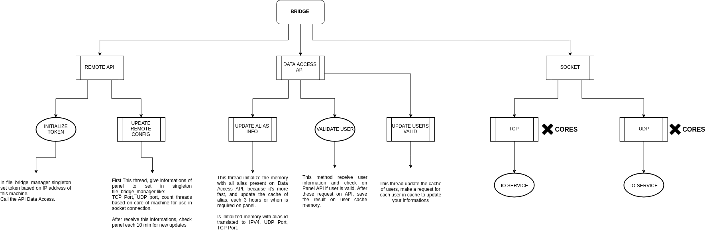

# Documentação da nova Ponte NoPing.

1. [Estrutura dos arquivos](#estrutura-dos-arquivos)
2. [Rodando Localhost](#rodando-localhost)
3. [Informações técnicas](#informações-técnicas)
    1. [Controller](#controller)
    2. [HTTP](#http)
4. [Socket](#socket)
5. [Oque é o bridge.conf ?](#bridgeconf)
6. [Dependências da ponte](#dependencias)


## Estrutura dos arquivos

A ponte contém informações e alguns acessos que não é necessário ter para debuga-la, para isso foi criado uma estrutura de pastas diferentes. Todas configurações que não são úteis para encontrar algum possível bug foi estruturada da seguinte forma:

```
folder/
--- base/
--- dev/
--- production/
```

**Base** nada mais é que uma **classe interface** que ambas classes do **dev/** e **production/** implementam.

### Estrutura das pastas
```
- Project
  - src
  - libs
  - config.h
  
- Src
  - controller
  - database
  - http
  - settings
  - socket
```
Todo código fonte está presente na pasta **src**, portanto a pasta **libs** contém apenas 
as dependências (curl por exemplo)


---
# Rodando Localhost

Para rodar localhost basta adicionar no pré-processador:

**TEST_API**

**TEST_DATABASE**

Dessa forma ira subir um servidor localhost na porta **1001**  UDP e **1000** TCP. **Podendo mudar essas portas no config.h**

```cpp
#define LOCAL_TCP_PORT 1000
#define LOCAL_UDP_PORT 1001
```


E a lógica para o retorno de alias será:

```text
alias 0 = {127.0.0.1, tcpport : 2000, udpport : 2001}
alias 1 = {127.0.0.1, tcpport : 2002, udpport : 2003}
alias 2 = {127.0.0.1, tcpport : 2004, udpport : 2005}
alias 3 = {127.0.0.1, tcpport : 2006, udpport : 2007}
``` 

E assim sequêncialmente

Onde a implementação é baseada nessa configuração.

```CPP
remote_api_base * remote_api_base::get_default()
{
	static remote_api_base* singleton = nullptr;
	if (!singleton) {
#if TEST_API
		singleton = new local_api();
#else
		singleton = new remote_api();
#endif
	}
	return singleton;
}
```

Para hablitar o modo de LOG (Printar os logs no console) basta definir 
**SCT_DEBUG** No pré-processador.

---
# Informações Técnicas

## Controller

Contém a classe **bridge_manager** no qual instânciará os sockets TCP/UDP com base nas configurações do painel ou com configurações default caso esteja em modo localhost 

---

## HTTP

Remote api fica responsável por pegar os dados contidos no bridge.conf e no painel. O procedimento de instalação da ponte funciona: 

- Cadastra a ponte no painel com o IP
- Ponte pega configuração dela baseada em seu IP

Ao instânciar a classe **remote_api** e chamar seu método **init** ela será responsável por capturar as configurações do painel que não estão presentes no arquivo **bridge.conf** como:

* Porta TCP/UDP
* Bind IP
* Threads Socket

e a cada **5 minutos** ela enviará um keep alive para o painel informando sua versão e perguntando por **tasks** 

Tasks cadastradas:

* UPDATE
* TERMINATE

*UPDATE* faz uma nova requisição para o painel pra capturar os alias e substituir o que está presente na memória.

*TERMINATE* Mata o processo da ponte 

#### HTTP Request

O **http_request** é um gerenciador de requests (post, get)
que funciona de forma **síncrona** pois ele é uma implementação da cURLib, e seu funcionamento é síncrono.

Initialmente o http_request contém apenas dois métodos públicos:

- do_request
- do_request_now

a única diferenca entre eles são que o **do_request** aloca sua requisição na pilha e o **do_request_now** faz com que sua requisição seja a próxima ( cortando a fila )

---
# BridgeConf
Inicialmente o bridge.conf contém somente:

```
##########################_NT_COMPANY_COPYRIGHT_21_06_2018################################
config_url				= <;5:@5<@587<A?778
key_token				= 7
```

config_url é a url de onde ele vai pegar os dados. **É importante estar criptografado usando EncrypterNPP.**

key_token é uma chave que é passada para o EncrypterNPP, por padrão pode deixar 7. *Seria a key para cifra de cesar*

Após fazer a requisição usando **remote_api** os dados recebidos do painel são inseridos na variável que continha somente os dados do arquivo de configuração(**bridge.conf**)

---

# Socket

Os sockets sao instanciados baseado no core da maquina. UDP com um valor um pouco acima do TCP.

O calculo para quantas threads vai ter cada socket baseado em seu core:

Se for um numero par de cores, tanto UDP quanto tcp terao o mesmo numero de threads.

No caso de um numero impar de cores. Udp ficara:

```
cores = (cores % 2 == 0) ? cores / 2 : (cores / 2) + 1; /* +1 To udp */
```

E tcp:
```
if (cores > 2)
	cores /= 2;
```




# Dependencias

Instalação por apt-get:
```bash
apt get install zip;
apt get install git;
apt-get install libcurl4-openssl-dev;
```
 **IMPORTANTE** clonar a **wpp** na home
 
 ```bash
 root@server:~# git clone https://github.com/1ncrivelSistemas/wpp.git
 ```
 
**IMPORTANTE** colocar **boost_1_58_0** na  home
```bash
root@server:~# ls -l
drwx------  9 root root      4096 Aug  9 03:12 boost_1_58_0
drwxr-xr-x 77 root root      4096 Aug 17 19:38 wpp
drwxr-xr-x  3 root root      4096 Aug 28 00:31 projects 
```
